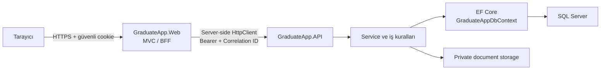

# GraduateApp

[](https://github.com/Sevilay01/GraduateApp/actions/workflows/ci.yml)

GraduateApp; lisansüstü program kataloğunu, dönemsel ilanları, öğrenci başvurularını, özel belgeleri ve değerlendirme sonuçlarını tek bir ASP.NET Core çözümünde yöneten Türkçe/İngilizce bir başvuru sistemidir. Tarayıcıya dönük MVC uygulaması bir BFF katmanı olarak çalışır; iş kuralları ve veri erişimi ayrı API projesindedir.

## Projenin amacı

Proje, lisansüstü başvuru sürecinin şu parçalarını izlenebilir ve rol bazlı bir akışta birleştirir:

- üniversite, enstitü ve program kataloğu;
- akademik yıl/dönem bazlı program ilanları;
- öğrenci profili, eğitim bilgileri ve sınav puanları;
- taslak başvuru, belge yükleme ve başvuru gönderimi;
- yönetici belge incelemesi, uygunluk ve puanlama;
- kontenjana göre sıralama, kesinleştirme ve sonuç yayımlama;
- hesap, davet, parola sıfırlama ve denetim kayıtları.

## Mevcut proje durumu

Kod tabanı .NET 10 üzerinde derlenen, xUnit testleri ve GitHub Actions kalite kapısı bulunan bir release-candidate durumundadır. Yeni dönemsel ilanlar güvenli belge ve değerlendirme iş akışlarını kullanır; migration öncesi kayıtlar uyumluluk bayraklarıyla legacy davranışını korur.

Production trafik açılışı hazır kabul edilmemelidir. Repository; production private storage, gerçek malware scanner, kalıcı ve çoklu instance uyumlu Data Protection key store, gerçek e-posta sağlayıcısı, kurumsal secret yönetimi, proxy/TLS topolojisi ve backup/restore altyapısını seçmez. Bu sağlayıcılar bağlanmadığında readiness veya belge yükleme akışı bilinçli olarak fail-closed davranır. Ayrıntılı kararlar için [production readiness belgesine](docs/production-readiness.md), kabul kapıları için [release-candidate kontrol listesine](docs/release-candidate-checklist.md) bakın.

Önemli veritabanı notu: çözüm database-first bir temel şemadan evrilmiştir. İlk migration boş bir veritabanını sıfırdan kurmak yerine beklenen mevcut temel şemayı güvenli biçimde sertleştirir. Bu nedenle repository tek başına temiz bir veritabanı oluşturmak için gereken kurumsal baseline şema scriptini içermez.

## Temel özellikler

- Açık ilanları program, enstitü, derece türü, akademik yıl ve dönem bilgileriyle listeleme ve arama
- Öğrenci kaydı, ayrı öğrenci/yönetici girişi, güvenli parola değiştirme ve parola sıfırlama
- Öğrenci profili, eğitim geçmişi ve sınav puanı yönetimi
- Taslak başvuru, zorunlu belge kontrolü, gönderme, geri çekme ve uygun koşullarda yeniden etkinleştirme
- PDF/JPEG/PNG doğrulaması, sürümlü belge yükleme ve yönetici belge onayı/reddi
- Üniversite, enstitü, program, İngilizce program adı, ilan, belge koşulu ve değerlendirme kriteri yönetimi
- Yönetici daveti, hesap etkinleştirme/devre dışı bırakma, kilit açma ve öğrenci hesap durumu yönetimi
- GNO, sınav puanı ve manuel puan kaynaklı ağırlıklı değerlendirme
- Kontenjan bazlı deterministik sıralama, ayrı kesinleştirme ve yayımlama adımları
- Türkçe ve İngilizce arayüz; program ve derece adlarında güvenli dil fallback'i
- Audit kayıtları, optimistic concurrency, correlation ID, health endpoint'leri ve güvenli ProblemDetails yanıtları

## Kullanılan teknolojiler

| Katman | Teknoloji |
| --- | --- |
| Runtime | .NET 10, C# |
| Web/BFF | ASP.NET Core MVC, Razor Views, cookie authentication, localization |
| API | ASP.NET Core Web API, role-based authorization, rate limiting, ProblemDetails |
| Veri | Entity Framework Core 10.0.10, SQL Server |
| Kimlik/güvenlik | ASP.NET Core Identity password hasher, Data Protection tabanlı süreli API token'ı |
| Arayüz | Bootstrap, jQuery ve jQuery Validation; bağımlılıklar `wwwroot/lib` altında sürümlenmiştir |
| Test | xUnit 2.9.3, ASP.NET Core `Microsoft.AspNetCore.Mvc.Testing`, EF Core InMemory ve SQL Server LocalDB entegrasyon testleri |
| CI | GitHub Actions, Windows runner, .NET 10, SQL Server LocalDB |

Solution paket sürümleri proje dosyalarında sabitlenmiştir; güncel kaynaklar [API proje dosyası](GraduateApp.API/GraduateApp.API.csproj), [Web proje dosyası](GraduateApp.Web/GraduateApp.Web.csproj) ve [test proje dosyasıdır](GraduateApp.Tests/GraduateApp.Tests.csproj).

## Genel mimari

Çözüm üç projeden oluşur:

- `GraduateApp.Web`: Tarayıcıya sunulan MVC arayüzü ve BFF. Kullanıcı oturumu güvenli cookie ile tutulur; API token'ı tarayıcı JavaScript'ine verilmez.
- `GraduateApp.API`: Authentication, authorization, doğrulama, başvuru, belge, katalog ve değerlendirme kuralları.
- `GraduateApp.Tests`: Servis, controller, Razor sözleşmesi, localization, migration, concurrency ve LocalDB entegrasyon testleri.

API içinde controller'lar HTTP sözleşmesini, service sınıfları iş kurallarını, `GraduateAppDbContext` ise EF Core modelini ve SQL Server erişimini taşır. Katalog ve başvuru verileri SQL Server'da; geliştirme belgeleri API projesinin web kökü dışında, Git tarafından izlenmeyen özel storage dizininde tutulur.

## İstek akışı: API, Web/BFF, EF Core ve SQL Server



1. Tarayıcı yalnız Web uygulamasıyla konuşur.
2. Başarılı girişte Web, kullanıcı claim'lerini ve API access token'ını şifreli `HttpOnly`, `Secure`, `SameSite=Lax` cookie oturumuna yazar.
3. Typed `HttpClient`, token'ı server-side API isteğinin `Authorization: Bearer` başlığına ekler.
4. API token'ın süresini, rolünü, security stamp'ini, hesap etkinliğini ve kilit durumunu doğrular.
5. Controller ilgili service'i çağırır; service transaction, yetki, iş kuralı ve concurrency kontrollerini uygular.
6. EF Core sorgu ve değişiklikleri SQL Server'a iletir. Belge içeriği veritabanına veya public `wwwroot` altına yazılmaz; veritabanında yalnız güvenli metadata ve opaque object key tutulur.

Normal BFF kullanımında tarayıcı API'ye doğrudan gitmediği için CORS gerekmez ve varsayılan origin listesi boştur. Doğrudan güvenilir bir browser origin gerekiyorsa yalnız açıkça izin verilen origin'ler yapılandırılmalıdır.

## Solution ve klasör yapısı

```text
GraduateApp/
├── .github/workflows/ci.yml       # Pull request ve main kalite kapısı
├── docs/                          # Aktif mimari ve operasyon belgeleri
├── GraduateApp.API/
│   ├── Controllers/               # Web API endpoint'leri
│   ├── Domain/                    # Durum, katalog ve puanlama kuralları
│   ├── DTOs/                      # API istek/yanıt sözleşmeleri
│   ├── Infrastructure/            # Hata, health, timeout ve correlation altyapısı
│   ├── Migrations/                # EF Core migration zinciri ve model snapshot
│   ├── Models/                    # Entity'ler ve GraduateAppDbContext
│   ├── Security/                  # API token üretme/doğrulama
│   └── Services/                  # Uygulama iş kuralları
├── GraduateApp.Web/
│   ├── Controllers/               # MVC/BFF controller'ları
│   ├── Localization/              # Ortak UI ve derece türü localization yardımcıları
│   ├── Models/                    # ViewModel ve Web sözleşmeleri
│   ├── Resources/                 # Türkçe ve İngilizce .resx kaynakları
│   ├── Services/                  # Typed API client ve token handler
│   ├── Views/                     # Razor Views
│   └── wwwroot/                   # CSS, JS, marka asset'i ve vendored frontend kitaplıkları
├── GraduateApp.Tests/             # Unit, contract, migration ve entegrasyon testleri
├── scripts/                       # Kontrollü yerel test/veri bakım scriptleri
└── GraduateApp.slnx               # Üç projeli solution tanımı
```

## Kullanıcı rolleri ve yetkilendirme

| Rol | Erişim |
| --- | --- |
| Anonymous | Açık ilanları görüntüleme, öğrenci kaydı, öğrenci/yönetici girişi, parola sıfırlama ve yönetici daveti kabulü |
| `Student` | Kendi profilini, eğitim ve sınav bilgilerini; yalnız kendi başvuru, belge ve yayımlanmış sonucunu yönetme/görüntüleme |
| `Admin` | Katalog, hesap, ilan, başvuru, belge koşulu, belge inceleme ve değerlendirme operasyonları |

Web controller'ları cookie rolüyle, API controller'ları `GraduateAppBearer` şeması ve rol claim'iyle korunur. Öğrenci sahipliği formdan gelen TC veya kullanıcı ID'sine güvenmez; doğrulanmış `NameIdentifier` claim'i ve sorgu sahiplik koşulları kullanılır. Yönetici ve öğrenci ekranları birbirinden ayrı role guard'ları taşır.

## Öğrenci başvuru yaşam döngüsü

Yeni belge iş akışındaki temel durumlar şöyledir:

```text
Draft → Pending → UnderReview → Approved
                           └──→ Rejected

Pending / UnderReview → Withdrawn → Draft
```

1. Öğrenci kayıt olur, giriş yapar ve profil/eğitim bilgilerini tamamlar.
2. İlanın istediği sınav puanlarını ekler. ALES tarih geçerliliği ilan son tarihine göre denetlenir.
3. Aktif, arşivlenmemiş ve başvuru tarih aralığında olan bir ilan için taslak oluşturur. Belge koşulları ve değerlendirme kriterleri bu anda başvuruya bağlanacak şekilde hazırlanır.
4. Zorunlu belgeleri yükler. Belge koşullarının ad, kod, tür, zorunluluk ve limit bilgileri snapshot olarak korunur.
5. Gönderimde zorunlu güncel belgeler ile otomatik puan kaynakları yeniden doğrulanır; sınav/GNO ve kriter verileri snapshot olarak kaydedilir, başvuru `Pending` olur.
6. Yönetici başvuruyu `UnderReview` durumuna alır, belgeleri inceler, uygunluk ve gerekiyorsa manuel puan kararlarını tamamlar.
7. İlan sonuçları kesinleştirilip yayımlandığında öğrenci yalnız kendi sonuç, sıra ve puan bileşenlerini görür.

Öğrenci, ilan hâlâ aktif başvuru penceresindeyken ve değerlendirme kesinleştirilmemişken `Pending` veya `UnderReview` başvurusunu geri çekebilir. Aynı koşullar devam ediyorsa `Withdrawn` başvuruyu `Draft` durumunda yeniden etkinleştirebilir. Bu işlemler `RowVersion` ile yarış durumlarına karşı korunur.

## Yönetici, program ilanı ve değerlendirme akışları

Yönetici tarafı şu operasyonları sunar:

- yönetici davet etme, daveti yeniden gönderme, hesabı etkinleştirme/devre dışı bırakma ve kilit açma;
- öğrenci hesabını etkinleştirme/devre dışı bırakma;
- üniversite ekleme; enstitü ve program oluşturma, güncelleme, etkinleştirme/devre dışı bırakma ve güvenli silme;
- programların İngilizce adlarını toplu düzenleme veya otomatik doldurma;
- akademik yıl/dönem, başvuru başlangıç/son tarihi, kontenjan ve sınav koşullarıyla ilan oluşturma;
- ilan bazlı belge gereksinimleri ve değerlendirme kriterleri tanımlama;
- başvuruları filtreleme, belgeleri indirme ve onaylama/reddetme;
- uygunluk kararı, manuel puan, sıralama önizlemesi, kesinleştirme ve ayrı onayla yayımlama.

Yeni ilan önce kapalı ve `Configuring` durumunda oluşturulur. Açılmadan önce en az bir aktif zorunlu belge koşulu ve geçerli değerlendirme politikası bulunmalıdır. İlk taslak başvurudan sonra kriter politikasını değiştiren işlemler engellenir. Kesinleştirme; ilan kapalı, son tarih geçmiş ve bütün aday kararları tamamlanmışken yapılabilir. Yayımlama ayrı bir adımdır ve başvuru durumlarını sonuçla uyumlu olarak `Approved` veya `Rejected` yapar.

## Belge yükleme ve private storage güvenliği

- Geliştirmede dosyalar varsayılan olarak `GraduateApp.API/.dev-storage/` altında, `wwwroot` dışında ve Git tarafından izlenmeden saklanır.
- Storage anahtarı kullanıcı dosya adından üretilmez; 32 karakterlik opaque bir anahtar kullanılır. Fiziksel yol veya doğrudan erişilebilir URL DTO'lara verilmez.
- Yalnız PDF, JPEG ve PNG kabul edilir. Uzantı, bildirilen content type ve magic-byte imzası birbiriyle eşleşmelidir.
- Global varsayılan limit 10 MB'dir; yapılandırılabilen üst sınır 100 MB'dir. Etkin limit, global limit ile ilan belge koşulu limitinin küçüğüdür.
- Dosya adı temizlenir, içerik streaming olarak SHA-256 ile özetlenir ve aynı requirement'ın güncel sürümüyle birebir aynı içerik reddedilir.
- Yeniden yükleme eski kaydı silmez; eski sürüm `IsCurrent=false`, yeni sürüm `Pending` inceleme durumunda kaydedilir. Önceki uygunluk kararı varsa yeniden inceleme için sıfırlanır.
- Öğrenci yalnız kendi belgesini, yönetici ise yalnız taslak dışındaki başvuruların belgesini korumalı endpoint üzerinden indirebilir.
- Geliştirme malware scanner'ı açıkça no-op'tur; virüs taraması garantisi vermez. Development dışında gerçek storage ve scanner/readiness sağlayıcıları yoksa yükleme 503 ile reddedilir.
- Metadata yazımı başarısız olursa storage nesnesi için best-effort compensation çalışır ve olay audit kaydına yazılır.

Gerçek storage içeriği, karantina dosyaları, kullanıcı belgeleri ve backup'lar repository'ye eklenmemelidir.

## Değerlendirme, kontenjan ve eşzamanlılık kuralları

Değerlendirme kriterleri üç kaynaktan gelebilir:

- `UndergraduateGpa`: 4 üzerinden lisans GNO;
- `ExamScore`: ilanın zorunlu sınav koşullarından birine bağlı puan;
- `ManualScore`: yönetici tarafından 100 üzerinden girilen puan.

Pozitif kriter ağırlıklarının toplamı tam olarak `10000` basis point olmalıdır. Kod ve tie-break öncelikleri ilan içinde benzersizdir. Puanlar yalnız `decimal` aritmetik ile hesaplanır:

```text
NormalizedExact = (RawScore / MaximumRawScore) × 100
NormalizedScore = round_away_from_zero(NormalizedExact, 4)
WeightedScore   = round_away_from_zero(NormalizedExact × WeightBasisPoints / 10000, 4)
TotalScore      = round_away_from_zero(sum(WeightedScore), 4)
```

Yeni değerlendirme akışında kontenjan başvuru gönderimini engellemez; kabul sayısını sonuç sıralamasında belirler. Legacy ilanlarda mevcut gönderim-kontenjan kuralı korunur. Uygun adaylar şu sırayla deterministik olarak sıralanır:

1. toplam puan azalan;
2. kriter önceliği sırasındaki normalize puanlar azalan;
3. başvuru tarihi artan;
4. başvuru `PublicID` değeri artan.

Zorunlu güncel belgeleri onaylanmayan aday uygun işaretlenemez. Finalize işlemi sıralama ve sonucu transaction içinde dondurur; publish edilene kadar öğrenciye göstermez. Mutasyonlarda `RowVersion`, uygun yerlerde `Serializable` transaction, unique/check constraint'leri ve deadlock/çakışma için güvenli 409 yanıtları kullanılır.

## Türkçe–İngilizce yerelleştirme

Web uygulaması `tr-TR` ve `en-US` kültürlerini destekler; varsayılan kültür Türkçedir. Dil seçimi yalnız izin verilen iki kültürden birini cookie'ye yazar. Razor metinleri ve validation mesajları ortak `.resx` kaynaklarından gelir.

- Türkçe canonical uygulama durumları, belge durumları, değerlendirme sonuçları ve akademik dönemler seçilen dile göre gösterilir.
- Derece türleri veritabanında canonical Türkçe değerleriyle kalır; `UiText.LocalizeDegreeType` bunları İngilizce resource anahtarlarına eşler.
- Tanınmayan bir derece türü veya İngilizce karşılığı olmayan program adı güvenli biçimde canonical/Türkçe değere düşer.
- Ondalık girişler Türkçe ve İngilizce kültürlerde ayrı model binding ve client validation kurallarıyla ele alınır.

## İngilizce program adı otomatik eşleme sistemi

`ProgramNameEnglishCatalog`, bilinen Türkçe program adlarını İngilizce karşılıklarına eşler. Normalizasyon:

1. baştaki/sondaki ve yinelenen boşlukları düzenler;
2. program adının sonundaki tanınan `(Doktora)`, `(Tezli YL)`, `(Tezsiz YL)` veya `(Uzaktan Tezsiz YL)` ekini eşleme anahtarından çıkarır;
3. Türkçe büyük/küçük harf kurallarıyla katalog eşleşmesi yapar.

Program oluşturma veya güncellemede İngilizce ad boşsa önce aynı normalize Türkçe ada ait mevcut bir çeviri yeniden kullanılır; yoksa katalog eşlemesi denenir. Toplu otomatik doldurma yalnız İngilizce adı boş kayıtları değiştirir. Bulunamayan adlar boş bırakılır ve yönetici çeviri ekranından elle girilebilir. Manuel/toplu güncellemeler `RowVersion` ve audit kayıtlarıyla korunur. İngilizce arayüz, `ProgramNameEnglish` doluysa bu değeri; değilse Türkçe program adını gösterir.

## Veritabanı yapısına genel bakış

| Alan | Başlıca tablolar | Amaç |
| --- | --- | --- |
| Kimlik ve hesap | `Admins`, `Students`, `LoginIdentities`, `PasswordResetTokens` | Tekil giriş kimliği, rol, kilit, davet ve parola sıfırlama |
| Katalog | `Universities`, `Institutes`, `Programs` | Üniversite/enstitü/program hiyerarşisi ve iki dilli program adı |
| İlan | `ProgramOfferings`, sınav/belge/kriter alt tabloları | Akademik dönem, tarih aralığı, kontenjan ve başvuru politikası |
| Öğrenci verisi | `EducationInfo`, `Exams`, `StudentExamScores` | Eğitim ve sınav kanıtları |
| Başvuru | `Applications`, `ApplicationStatusHistory` | Başvuru sahibi, ilan, durum ve kronolojik geçmiş |
| Belge | requirement snapshot ve `ApplicationDocuments` | İlan koşulunu dondurma, sürüm, review ve storage metadata |
| Değerlendirme | `ApplicationEvaluations`, components ve score snapshots | Uygunluk, puan bileşenleri, sıralama ve sonuç |
| Denetim | `SecurityAuditLogs`, `SystemLogs` | Güvenlik ve operasyon olayları |

Model; tarihsel kaybı önlemek için çoğunlukla `Restrict`, açık çocuk yaşam döngülerinde `Cascade` kullanır. Program kalıcı katalog kaydıdır; `ProgramOffering` ise belirli akademik yıl ve dönemdeki ilandır. Başvuru, belge koşulu ve puan snapshot'ları daha sonra değişen katalog verilerinin geçmiş sonuçları bozmasını engeller.

### Ayrıntılı veritabanı ve kod mimarisi

Tablo ilişkileri, PK/FK yönleri, silme davranışları, Mermaid ER diyagramları ve kod okuma sırası için [Veritabanı ve Kod Mimarisi](docs/Veritabani-ve-Kod-Mimarisi.md) belgesini kullanın.

## Gereksinimler

- Git
- .NET 10 SDK
- SQL Server erişimi; Windows'ta LocalDB entegrasyon testleri için `MSSQLLocalDB`
- EF Core CLI 10.0.10
- Yerel HTTPS için .NET development certificate
- İki uygulamayı birlikte çalıştırmak için iki terminal

Kurulum kontrolü:

```powershell
dotnet --info
dotnet tool install --global dotnet-ef --version 10.0.10
dotnet ef --version
dotnet dev-certs https --trust
```

`dotnet-ef` zaten kuruluysa sürümü eşitlemek için `dotnet tool update --global dotnet-ef --version 10.0.10` kullanın.

## Yerel geliştirme ortamının hazırlanması

```powershell
git clone https://github.com/Sevilay01/GraduateApp.git
Set-Location GraduateApp
dotnet restore GraduateApp.slnx
```

Ardından API connection string'ini user-secrets ile yapılandırın, uyumlu database-first baseline şemayı hazırlayın ve migration'ları uygulayın. API ile Web'i HTTPS profilleriyle ayrı terminallerde başlatın.

Development ortamındaki şu dizinler çalışma sırasında otomatik oluşabilir ve Git tarafından izlenmez:

- `GraduateApp.API/.dev-emails/`: parola sıfırlama ve yönetici davet e-postalarının yerel outbox'ı;
- `GraduateApp.API/.dev-storage/`: private belge içeriği.

Bu dizinlerdeki dosyalar gerçek e-posta bağlantıları veya kullanıcı belgeleri içerebilir; commit etmeyin ve paylaşmayın.

## Connection string ve user-secrets yapılandırması

API projesinde `UserSecretsId` tanımlıdır. Repository'ye gerçek connection string, parola, token veya kişisel yol yazmayın.

```powershell
dotnet user-secrets set "ConnectionStrings:DefaultConnection" "<uyumlu-baseline-veritabanina-ait-yerel-connection-string>" --project GraduateApp.API
```

İlk yönetici yalnız sistemde hiç yönetici yokken isteğe bağlı olarak bootstrap edilebilir. İki değer birlikte verilmelidir:

```powershell
dotnet user-secrets set "BootstrapAdmin:Email" "admin@example.invalid" --project GraduateApp.API
dotnet user-secrets set "BootstrapAdmin:Password" "<en-az-12-karakter-guclu-gecici-parola>" --project GraduateApp.API
```

Parola en az 12 karakter; büyük harf, küçük harf, rakam ve özel karakter içermelidir. Bootstrap mevcut yöneticinin parolasını değiştirmez, ikinci yönetici oluşturmaz ve ilk girişte parola değişikliğini zorunlu kılar. Hesap oluşturulduktan sonra bootstrap secret'larını kaldırın:

```powershell
dotnet user-secrets remove "BootstrapAdmin:Email" --project GraduateApp.API
dotnet user-secrets remove "BootstrapAdmin:Password" --project GraduateApp.API
```

Başlıca environment variable karşılıkları:

```text
ConnectionStrings__DefaultConnection
BootstrapAdmin__Email
BootstrapAdmin__Password
Web__BaseUrl
Cors__AllowedOrigins__0
DocumentUpload__MaximumBytes
DocumentStorage__DevelopmentRootPath
GraduateApi__BaseAddress
GraduateApi__TimeoutSeconds
GraduateApi__InnerDependencyTimeoutSeconds
```

`appsettings.json` yalnız secret olmayan varsayılan ve boş şablon değerleri içerir. `appsettings.Development.json`, `.env`, private key ve sertifika dosyaları ignore edilir; gerçek secret'ları bu dosyalarla commit etmeyin.

## Migration ve veritabanı oluşturma

Migration'ları incelemek ve uyumlu mevcut veritabanına uygulamak için:

```powershell
dotnet ef migrations list --project GraduateApp.API --startup-project GraduateApp.API
dotnet ef migrations script --idempotent --project GraduateApp.API --startup-project GraduateApp.API --output "$env:TEMP\GraduateApp.Migrations.sql"
dotnet ef database update --project GraduateApp.API --startup-project GraduateApp.API
```

Bu komutlardan önce doğrulanmış bir backup alın ve üretilen idempotent scripti inceleyin. İlk migration olan `HardenExistingSchema`, beklenen legacy tablolar yoksa veya güvenli dönüşümü engelleyen duplicate/tanımsız veri varsa transaction'ı hata ile durdurur; eksik baseline şemayı üretmez.

Temiz ortam kurulumu bu sırayı gerektirir:

1. DBA tarafından onaylanmış mevcut database-first baseline şemayı yeni/izole SQL Server veritabanına kurun veya doğrulanmış bir baseline restore edin.
2. `ConnectionStrings:DefaultConnection` değerini bu veritabanına yöneltin.
3. İdempotent migration scriptini üretip inceleyin.
4. `dotnet ef database update` ile repository'deki migration zincirini uygulayın.

Repository'de baseline create/seed scripti bulunmadığı için yalnız bu repository ile boş veritabanından tam şema üretildiği iddia edilmez. Uygulama başlangıcında otomatik migration çalışmaz. Migration geri alma işlemleri de veri kaybı nedeniyle otomatik kabul edilmez; önceki uygulama sürümü ve doğrulanmış database restore'u ile DBA kontrollü planlanmalıdır.

## API ve Web projelerini çalıştırma

İlk terminal:

```powershell
dotnet run --project GraduateApp.API --launch-profile https
```

İkinci terminal:

```powershell
dotnet run --project GraduateApp.Web --launch-profile https
```

Doğrulanmış development HTTPS adresleri:

- API: `https://localhost:7037`
- Web: `https://localhost:7272`
- API liveness: `https://localhost:7037/health/live`
- API readiness: `https://localhost:7037/health/ready`

Web varsayılan olarak `https://localhost:7037/` API adresini kullanır. Farklı bir adres gerekiyorsa `GraduateApi__BaseAddress` ayarlayın. Güvenli cookie nedeniyle normal yerel kullanımda Web'in HTTPS profilini açın.

## Build, test ve format doğrulama

Repository kökünde şu kalite kapılarını çalıştırın:

```powershell
dotnet restore
dotnet build GraduateApp.slnx -c Release --no-restore -m:1 /p:UseSharedCompilation=false /nodeReuse:false
dotnet test GraduateApp.slnx -c Release --no-build -m:1 /p:UseSharedCompilation=false /nodeReuse:false
dotnet format GraduateApp.slnx --verify-no-changes --no-restore
git diff --check
```

Testler; authentication/authorization, sahiplik izolasyonu, katalog ve ilan kuralları, belge doğrulama/storage, değerlendirme ve sıralama, optimistic concurrency, migration güvenliği, Türkçe/İngilizce UI ve Web/API hata sözleşmelerini kapsar. Test sayısı değişebileceği için README'de sabitlenmez; güncel sonucu `dotnet test` çıktısından izleyin.

SQL entegrasyon testleri Windows `MSSQLLocalDB` üzerinde benzersiz geçici veritabanları oluşturur ve test sonunda yalnız güvenli ad kalıbına uyan bu geçici veritabanlarını kaldırır. LocalDB bulunamadığında CI testleri sessizce atlamaz.

## GitHub Actions ve CI

[`.github/workflows/ci.yml`](.github/workflows/ci.yml) tüm pull request'lerde ve `main` dalına yapılan push'larda Windows runner üzerinde çalışır. Workflow:

1. repository'yi credential persist etmeden checkout eder;
2. .NET 10 SDK ve EF Core CLI 10.0.10 kurar;
3. `MSSQLLocalDB` varlığını zorunlu kılar;
4. restore, Release build ve test çalıştırır;
5. `dotnet format` ile biçimi doğrular;
6. runner'ın geçici dizininde idempotent migration scripti üretir;
7. doğrudan ve transitif NuGet paketlerini bilinen açıklara karşı tarar;
8. `git diff --check` ile whitespace hatalarını denetler.

CI migration scripti üretir ancak herhangi bir gerçek veya kalıcı veritabanına migration uygulamaz.

## Güvenlik notları

- Parolalar `PasswordHasher<TUser>` ile hashlenir; repository'de varsayılan hesap veya parola yoktur.
- API access token'ları Data Protection ile süreli üretilir ve her istekte security stamp/hesap durumu doğrulanır. Logout veya parola değişimi mevcut oturumu geçersiz kılar.
- Web cookie'si `HttpOnly`, `Secure`, `SameSite=Lax`, 30 dakikalık ve non-sliding olarak yapılandırılmıştır.
- MVC mutasyonları global antiforgery doğrulamasına tabidir. Login, kayıt ve parola sıfırlama endpoint'lerinde IP bazlı rate limit politikaları vardır.
- API hataları güvenli ProblemDetails sözleşmesi ve correlation ID taşır; connection string, stack trace veya token response'a eklenmez.
- CORS varsayılan olarak kapalıdır; yalnız yapılandırılan origin'ler kabul edilir.
- Belge içerikleri public web kökünde değildir; sahiplik ve rol kontrollü indirme endpoint'lerinden sunulur.
- Development no-op scanner production güvenlik garantisi değildir. Production provider'ları yoksa yükleme fail-closed kalır.
- Development dışındaki mevcut Data Protection kaydı ephemeral'dır; kurumsal kalıcı provider ve readiness probe bağlanmadan multi-instance/restart sürekliliği varsaymayın.
- User-secrets yalnız geliştirme içindir. Production secret'ları platform secret store veya managed identity ile sağlayın.
- Gerçek kullanıcı belgelerini, `.bak`/database dosyalarını, storage/karantina içeriğini, e-posta outbox'ını veya migration çıktılarını Git'e eklemeyin.

Production kabulü, health/timeout sözleşmesi ve provider karar matrisi için [production readiness belgesini](docs/production-readiness.md) izleyin.

## Sorun giderme

### `ConnectionStrings:DefaultConnection` yapılandırılmamış

API ve EF tasarım zamanı factory'si boş connection string ile bilinçli olarak başlamaz. User-secrets kaydını ve doğru proje hedefini kontrol edin:

```powershell
dotnet user-secrets list --project GraduateApp.API
```

### İlk migration boş veritabanında duruyor

Bu beklenen davranıştır. `HardenExistingSchema` database-first baseline tablolarını arar. Kurumsal baseline şemayı/restore'u hazırlamadan migration'ı zorlamayın veya migration dosyalarını değiştirmeyin.

### Web API'ye erişemiyor veya 503 gösteriyor

Önce API'yi başlatın; `https://localhost:7037/health/live` ve `/health/ready` yanıtlarını kontrol edin. Web adresi farklıysa `GraduateApi__BaseAddress` değerini gerçek API HTTPS adresine yöneltin. İç timeout değerinin Web timeout'undan kısa kalması gerekir.

### Login sonrası oturum korunmuyor

Web'i HTTPS profiliyle açın, development certificate'ı güvenilir hâle getirin ve API/Web saatlerinin doğru olduğunu kontrol edin. API 401 döndürürse BFF mevcut cookie oturumunu kapatır.

### Development parola sıfırlama veya davet e-postası görünmüyor

API Development ortamında çalışıyorsa Git tarafından izlenmeyen `GraduateApp.API/.dev-emails/` dizinini kontrol edin. Production'da gerçek e-posta provider'ı olmadan gönderim yapılmaz.

### Belge yükleme 503 ile reddediliyor

Development ortamını, storage dizini erişimini ve scanner/storage provider durumunu kontrol edin. Production'da gerçek `IPrivateFileStorage`, `IFileMalwareScanner` ve readiness probe bağlanmadan bu hata bilinçli fail-closed davranıştır.

### Değişiklik 409 concurrency hatası veriyor

Kayıt başka bir istek veya yönetici tarafından güncellenmiştir. Sayfayı yenileyip yeni `RowVersion` ile işlemi tekrar uygulayın; stale değeri zorlamayın.

### LocalDB entegrasyon testleri çalışmıyor

Windows'ta `sqllocaldb info` ile `MSSQLLocalDB` örneğini doğrulayın. CI bu bağımlılığı zorunlu tutar; LocalDB olmadan entegrasyon testlerini geçmiş saymayın.

## Katkı ve branch/PR çalışma düzeni

Değişiklikleri güncel `main` üzerinden ayrı bir dalda hazırlayın:

```powershell
git switch main
git pull --ff-only
git switch -c kisa-degisiklik-aciklamasi
```

- Uygulama davranışı, migration ve dokümantasyon değişikliklerini aynı PR'da açıkça sınıflandırın.
- Migration gerekiyorsa ileri yönlü ekleyin; uygulanmış migration dosyalarını değiştirmeyin ve gerçek veritabanında otomatik işlem yapmayın.
- Secret, gerçek kullanıcı verisi, storage içeriği ve yeniden üretilebilir build/migration çıktısı commit etmeyin.
- README ve docs bağlantılarını, build/test/format sonuçlarını ve `git diff --check` çıktısını PR öncesi doğrulayın.
- Yalnız göreve ait dosyaları stage edin, anlamlı bir commit mesajı kullanın ve CI yeşil olmadan merge etmeyin.
- PR açıklamasında davranış etkisini, veri/migration etkisini, güvenlik notlarını ve çalıştırılan doğrulamaları yazın.
