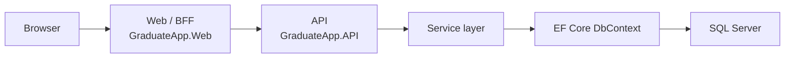
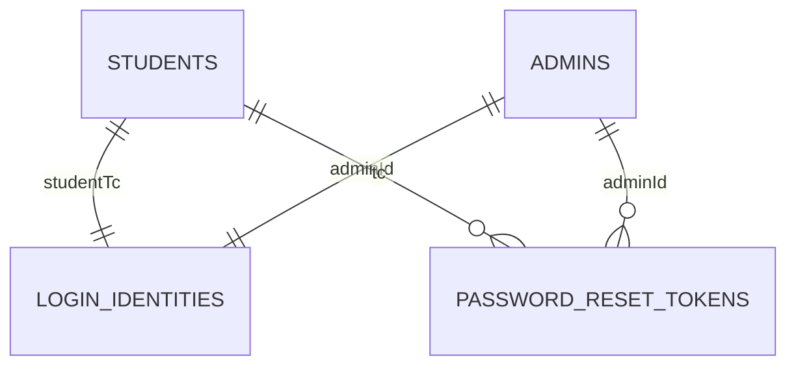
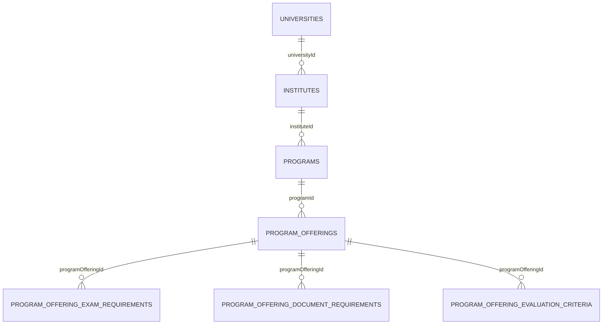
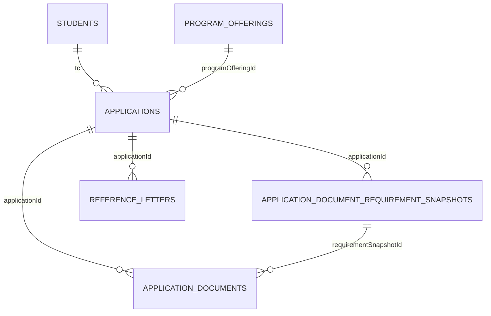
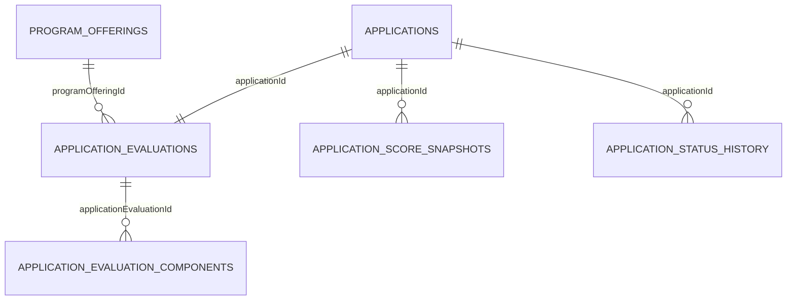

# Veritabanı ve Kod Mimarisi

Bu doküman, `GraduateApp` projesinin gerçek kod tabanına dayanır. Amaç, sistemi yeni inceleyen birinin veritabanı şemasını, MVC/BFF akışını ve kritik iş kurallarını hızlıca anlayabilmesidir.

## Projenin amacı

`GraduateApp`, lisansüstü program ilanlarını, öğrenci başvurularını, belge yönetimini, değerlendirme sürecini ve yönetici operasyonlarını tek bir uygulama üzerinden yürütür.

Temel roller:

- Öğrenci: profilini, eğitim ve sınav bilgilerini yönetir; açık ilanları görür; başvuru oluşturur; belge yükler; sonucunu takip eder.
- Yönetici: program, ilan, belge gereksinimi, değerlendirme ve kullanıcı yönetimini yapar.
- Public kullanıcı: açık programları ve katalog bilgilerini görüntüler.

Başvuru yaşam döngüsü kabaca şöyledir:

1. Öğrenci sisteme kayıt olur ve giriş yapar.
2. Profil, eğitim ve sınav bilgilerini doldurur.
3. Açık bir program offering seçer ve draft başvuru oluşturur.
4. Zorunlu belgeleri yükler.
5. Başvuru gönderilir ve durum geçmişi tutulur.
6. Değerlendirme bileşenleri hesaplanır.
7. Yönetici başvuruyu finalize eder ve sonuçları yayınlar.

## Çözüm mimarisi

Proje üç ana parçada okunabilir:

- Web/BFF: [GraduateApp.Web/Program.cs](../GraduateApp.Web/Program.cs), [GraduateApp.Web/Controllers](../GraduateApp.Web/Controllers), [GraduateApp.Web/Views](../GraduateApp.Web/Views)
- API: [GraduateApp.API/Program.cs](../GraduateApp.API/Program.cs), [GraduateApp.API/Controllers](../GraduateApp.API/Controllers), [GraduateApp.API/Services](../GraduateApp.API/Services)
- Testler: [GraduateApp.Tests](../GraduateApp.Tests)

Ek akışlar:

- EF Core ve veri erişimi: [GraduateApp.API/Models/GraduateAppDbContext.cs](../GraduateApp.API/Models/GraduateAppDbContext.cs)
- SQL Server: migration ve model snapshot dosyaları üzerinden doğrulanır.
- Private document storage: [GraduateApp.API/Services/DocumentStorage.cs](../GraduateApp.API/Services/DocumentStorage.cs)

Kısa istek akışı:

## Veritabanı yapısı

Aşağıdaki tablo grupları, [GraduateApp.API/Models/GraduateAppDbContext.cs](../GraduateApp.API/Models/GraduateAppDbContext.cs) ve migration dosyalarından doğrulanmıştır.

### Kimlik doğrulama ve kullanıcılar

| Tablo | Amaç | PK | Önemli FK | Yön | Kısıtlar / indexler | Silme davranışı | Yaşam döngüsü |
|---|---|---:|---|---|---|---|---|
| `Admins` | Yönetici hesapları | `AdminID` | - | - | `PublicID` unique, `NormalizedEmail` unique | - | Yönetici oturumu, davet ve kilit akışları |
| `Students` | Öğrenci kayıtları | `TC` | - | - | `PublicID` unique, `NormalizedEmail` unique, `Telephone` unique filtered | - | Öğrenci profilinin ana kaydı |
| `LoginIdentities` | Tekil giriş kimliği | `LoginIdentityID` | `StudentTC`, `AdminID` | öğrenci/admin → login | `NormalizedEmail` unique, öğrenci/admin için filtered unique | öğrenci ve admin ile cascade | Giriş, rol ve hesap bağlama |
| `PasswordResetTokens` | Şifre sıfırlama jetonları | `PasswordResetTokenID` | `TC`, `AdminID` | kullanıcı → token | `TokenHash` unique | öğrenci ve admin ile cascade | Geçici güvenlik kaydı |
| `SecurityAuditLogs` | Güvenlik/audit izi | `SecurityAuditLogID` | - | - | `CreatedAtUtc` index | - | Değişikliklerin denetlenmesi |
| `SystemLogs` | Sistem olayları | `SystemLogID` | `AdminID`, `TC` | yönetici/öğrenci → log | - | restrict | Operasyonel izleme |

### Enstitü / program kataloğu

| Tablo | Amaç | PK | Önemli FK | Yön | Kısıtlar / indexler | Silme davranışı | Yaşam döngüsü |
|---|---|---:|---|---|---|---|---|
| `Universities` | Üniversite sözlüğü | `UniversityID` | - | - | `UniversityName` unique | - | Katalog kökü |
| `Institutes` | Enstitü sözlüğü | `InstituteID` | `UniversityID` | enstitü → üniversite | `InstituteName` unique, ad alanı check kısıtları | restrict | Programların üst kataloğu |
| `Programs` | Canonical program tanımı | `ProgramID` | `InstituteID` | program → enstitü | `(InstituteID, ProgramName, DegreeType)` unique, `DegreeType` check | restrict | Offering’lerin temel şablonu |

### Program offering / ilan yapısı

| Tablo | Amaç | PK | Önemli FK | Yön | Kısıtlar / indexler | Silme davranışı | Yaşam döngüsü |
|---|---|---:|---|---|---|---|---|
| `ProgramOfferings` | Belirli yıl/dönem için ilan | `ProgramOfferingID` | `ProgramID` | offering → program | `(ProgramID, AcademicYearStart, Term)` unique, quota/check kısıtları | restrict | Başvuru açma/kapatma ve sonuçlandırma |
| `ProgramOfferingExamRequirements` | Offering bazlı sınav şartı | `ProgramOfferingExamRequirementID` | `ProgramOfferingId`, `ExamId` | requirement → offering/exam | `(ProgramOfferingId, ExamId)` unique | offering ile cascade, exam ile restrict | Uygunluk kuralları |
| `ProgramOfferingDocumentRequirements` | Offering bazlı belge şartı | `ProgramOfferingDocumentRequirementID` | `ProgramOfferingId` | requirement → offering | `PublicID` unique, `(ProgramOfferingId, NormalizedDocumentCode)` unique | restrict | Zorunlu belgeler |
| `ProgramOfferingEvaluationCriteria` | Değerlendirme kriteri | `ProgramOfferingEvaluationCriterionID` | `ProgramOfferingId`, `ExamId` | criterion → offering/exam | `PublicID` unique, `TieBreakPriority` unique, `SourceType` sınırlamaları | restrict | Puanlama ve sıralama |

Program ile offering arasındaki fark önemlidir:

- `Program`, kataloğun kalıcı tanımıdır.
- `ProgramOffering`, belirli akademik yıl ve dönem için açılmış ilana karşılık gelir.
- Aynı program, farklı yıllarda ve dönemlerde birden fazla offering üretebilir.
- Başvuru ve değerlendirme kayıtları offering’e bağlanır; böylece tarihsel bağ korunur.

### Başvuru ve eğitim/sınav bilgileri

| Tablo | Amaç | PK | Önemli FK | Yön | Kısıtlar / indexler | Silme davranışı | Yaşam döngüsü |
|---|---|---:|---|---|---|---|---|
| `Applications` | Öğrenci başvurusu | `ApplicationID` | `ProgramOfferingId`, `TC` | application → offering/student | `PublicID` unique, `(TC, ProgramOfferingId)` unique, durum check | restrict | Draft, submitted, reviewed, finalized |
| `ApplicationStatusHistory` | Durum geçmişi | `ApplicationStatusHistoryID` | `ApplicationId`, `ChangedByAdminId` | history → application/admin | - | application cascade, admin restrict | Denetlenebilir durum geçmişi |
| `EducationInfo` | Öğrenci eğitim geçmişi | `EducationInfoID` | `TC`, `UniversityID` | eğitim → öğrenci/üniversite | - | student cascade, university restrict | Profil doğrulama |
| `Exams` | Sınav sözlüğü | `ExamID` | - | - | `ExamName` unique | - | Başvuru ve puan kuralı sözlüğü |
| `StudentExamScores` | Öğrenci sınav puanları | `StudentExamScoreID` | `TC`, `ExamID` | score → student/exam | `(TC, ExamID)` unique | student cascade, exam restrict | Puan doğrulama |
| `ReferenceLetters` | Referans mektupları | `ReferenceLetterID` | `ApplicationId` | letter → application | - | application cascade | Başvuruya bağlı destek belgesi |

### Belge yönetimi

| Tablo | Amaç | PK | Önemli FK | Yön | Kısıtlar / indexler | Silme davranışı | Yaşam döngüsü |
|---|---|---:|---|---|---|---|---|
| `ApplicationDocumentRequirementSnapshots` | Başvuru anındaki belge şartı snapshot’ı | `ApplicationDocumentRequirementSnapshotID` | `ApplicationId`, `SourceRequirementId` | snapshot → application/requirement | `(ApplicationId, DocumentCode)` unique | restrict | İlan değişse bile başvuru şartını sabitlemek |
| `ApplicationDocuments` | Yüklenen belge sürümleri | `ApplicationDocumentID` | `ApplicationId`, `RequirementSnapshotId`, `ReviewedByAdminId` | document → application/snapshot/admin | `PublicID` unique, `ObjectKey` unique, `RequirementSnapshotId` filtered unique (current), version unique | restrict | Güncel/önceki belge sürümleri ve inceleme |

Belge yapısı, şart değişikliklerinden etkilenmeyen bir başvuru izi oluşturur. Bu nedenle şart tablosu ile başvuruya ait snapshot ayrıdır.

### Değerlendirme ve sonuçlandırma

| Tablo | Amaç | PK | Önemli FK | Yön | Kısıtlar / indexler | Silme davranışı | Yaşam döngüsü |
|---|---|---:|---|---|---|---|---|
| `ApplicationEvaluations` | Başvurunun değerlendirme özeti | `ApplicationEvaluationID` | `ApplicationId`, `ProgramOfferingId`, `EligibilityDecidedByAdminId` | evaluation → application/offering/admin | `ApplicationId` unique, `(ProgramOfferingId, Rank)` filtered unique | restrict | Uygunluk, sıralama, karar özeti |
| `ApplicationEvaluationComponents` | Bileşen bazlı değerlendirme puanı | `ApplicationEvaluationComponentID` | `ApplicationEvaluationId`, `SourceCriterionId`, `ManualScoredByAdminId` | component → evaluation/criterion/admin | `CodeSnapshot`, `TieBreakPrioritySnapshot` unique | restrict | Son puan hesaplamasının parçaları |
| `ApplicationScoreSnapshots` | Başvuruya ait sınav puan snapshot’ı | `ApplicationScoreSnapshotID` | `ApplicationId`, `ExamId` | snapshot → application/exam | `(ApplicationId, ExamId)` unique | restrict | Sonuçları sonradan değişmeyen puan izi |
| `VwAdminApplicationSummary` | Yönetici özet görünümü | - | - | view | sorgu performansı için projection | - | Liste ekranları için birleşik okuma |

Değerlendirme akışında snapshot kullanılması şu nedenle önemlidir:

- İlan kuralları değişse bile o anki başvuru kanıtı korunur.
- Admin tarafından yapılan manuel hesaplama adımları izlenebilir.
- Sonradan güncellenen katalog verisi, geçmiş sonuçları bozmaz.

## PK/FK ilişkileri ve nedenleri

### Program ve offering

`Program`, akademik kataloğun kalıcı kaydıdır. `ProgramOffering` ise belirli bir akademik yıl ve dönemde açılan ilan kaydıdır. Offering’i programdan ayırmak şu avantajları sağlar:

- Aynı program için her yıl yeni ilan açılabilir.
- Başvuru ve değerlendirme sonuçları tarihsel olarak saklanır.
- Kontenjan, başvuru başlangıcı, son tarih ve değerlendirme kuralları offering bazında yönetilir.

### Application bağımlılıkları

Bir `Application`, hem öğrenciye hem de offering’e bağlıdır. Bu ilişki, başvurunun hangi öğrenci tarafından, hangi ilan için yapıldığını net biçimde sabitler.

### Document requirement ilişkisi

`ProgramOfferingDocumentRequirement` ilanın güncel şartını tanımlar. `ApplicationDocumentRequirementSnapshot` ise başvuru oluşturulduğunda bu şartı dondurur. Böylece ilan değişse bile başvuruya ait yasal/işlemsel referans korunur.

### Evaluation, criterion, component, score snapshot

- `ApplicationEvaluation`, başvurunun üst düzey değerlendirme kaydıdır.
- `ApplicationEvaluationComponent`, puanın hangi kriterlerden oluştuğunu tutar.
- `ApplicationScoreSnapshot`, sınav sonuçlarının değerlendirme anındaki halini saklar.
- Bu ayrım, hem saydamlık hem de tekrar hesaplanabilirlik sağlar.

### Status history ve snapshot tabloları

Durum geçmişi, başvurunun hangi aşamalardan geçtiğini kronolojik olarak gösterir. Snapshot tabloları ise geçmişteki kararların, sonradan değişen katalog verilerinden bağımsız kalmasını sağlar.

### ReferenceLetter yapısı

`ReferenceLetter`, başvuruya bağlı destekleyici bir belgedir ve başvuruyla birlikte yaşam döngüsü sürer. Başvuru silinmediği sürece referans kaydı da korunur.

### Silme davranışları

Şema genel olarak veri kaybını önlemek için `Restrict` ağırlıklıdır. Doğrudan çocuk kayıt bağımlılığı olduğu durumlarda veya net yaşam döngüsü şartlarında `Cascade` kullanılır. Bu yaklaşım orphan kayıtları azaltır ve yanlışlıkla ana veri silinmesini engeller.

## Mermaid diyagramları

### 1. Kullanıcı ve kimlik doğrulama

### 2. Program ve offering

### 3. Başvuru ve belgeler

### 4. Değerlendirme ve sonuçlandırma

## Önemli iş akışları

### Öğrenci kaydı ve giriş

- Kayıt ve doğrulama akışı [GraduateApp.Web/Controllers/AccountController.cs](../GraduateApp.Web/Controllers/AccountController.cs) üzerinden başlar.
- API tarafında kimlik doğrulama [GraduateApp.API/Controllers/AuthController.cs](../GraduateApp.API/Controllers/AuthController.cs) ve [GraduateApp.API/Services/AuthService.cs](../GraduateApp.API/Services/AuthService.cs) ile yürür.
- Öğrenci verisi [GraduateApp.API/Models/Student.cs](../GraduateApp.API/Models/Student.cs) ve [GraduateApp.API/Models/LoginIdentity.cs](../GraduateApp.API/Models/LoginIdentity.cs) tarafından taşınır.

### Profil / eğitim / sınav yönetimi

- Profil ekranları: [GraduateApp.Web/Controllers/PanelController.cs](../GraduateApp.Web/Controllers/PanelController.cs), [GraduateApp.Web/Views/Panel/Profile.cshtml](../GraduateApp.Web/Views/Panel/Profile.cshtml)
- API servisleri: [GraduateApp.API/Services/StudentProfileService.cs](../GraduateApp.API/Services/StudentProfileService.cs), [GraduateApp.API/Services/StudentExamScoreService.cs](../GraduateApp.API/Services/StudentExamScoreService.cs)

### Program ilanı hazırlama ve açma

- Yönetici ekranı: [GraduateApp.Web/Controllers/AdminController.cs](../GraduateApp.Web/Controllers/AdminController.cs), [GraduateApp.Web/Views/Admin/Offerings.cshtml](../GraduateApp.Web/Views/Admin/Offerings.cshtml)
- İş mantığı: [GraduateApp.API/Services/ProgramOfferingService.cs](../GraduateApp.API/Services/ProgramOfferingService.cs), [GraduateApp.API/Services/ProgramAdminService.cs](../GraduateApp.API/Services/ProgramAdminService.cs)

### Draft başvuru ve belge yükleme

- Başvuru servisleri: [GraduateApp.API/Services/ApplicationService.cs](../GraduateApp.API/Services/ApplicationService.cs), [GraduateApp.API/Services/ApplicationDocumentService.cs](../GraduateApp.API/Services/ApplicationDocumentService.cs)
- Özel belge depolama: [GraduateApp.API/Services/DocumentStorage.cs](../GraduateApp.API/Services/DocumentStorage.cs)

### Değerlendirme ve finalize

- Değerlendirme: [GraduateApp.API/Services/ApplicationEvaluationService.cs](../GraduateApp.API/Services/ApplicationEvaluationService.cs), [GraduateApp.API/Services/EvaluationPolicyService.cs](../GraduateApp.API/Services/EvaluationPolicyService.cs)
- Yönetici sonuç ekranı: [GraduateApp.Web/Views/Admin/Evaluation.cshtml](../GraduateApp.Web/Views/Admin/Evaluation.cshtml)

## Güvenlik ve veri bütünlüğü

- Authentication/authorization: Web tarafında rol bazlı koruma, API tarafında bearer tabanlı koruma vardır.
- BFF/session yaklaşımı: Web uygulaması kullanıcıya yakın bir katman olarak API’yi tüketir ve oturum bilgisini taşır.
- Antiforgery: Form gönderimlerinde kullanılır.
- Belge sahipliği: Belgeler başvuru ve requirement snapshot ile bağlanır; private storage kullanımı [GraduateApp.API/Services/DocumentStorage.cs](../GraduateApp.API/Services/DocumentStorage.cs) üzerinden soyutlanır.
- Dosya tipi/boyut/signature kontrolleri: [GraduateApp.API/Services/DocumentFileValidator.cs](../GraduateApp.API/Services/DocumentFileValidator.cs) ve [GraduateApp.API/Services/DocumentMalwareScanner.cs](../GraduateApp.API/Services/DocumentMalwareScanner.cs).
- Optimistic concurrency: `RowVersion` alanı birçok yönetici formunda ve tabloda kullanılır.
- Transaction kullanımı: İşlem bütünlüğü gereken servislerde uygulanır.
- Snapshot’lar: Başvuru anındaki şart ve puan izlerini değiştirilmez hale getirir.
- Audit log: [GraduateApp.API/Models/SecurityAuditLog.cs](../GraduateApp.API/Models/SecurityAuditLog.cs)
- Hata davranışı: API ve Web katmanında kullanıcıya güvenli, sınırlı ve doğrulanmış hata mesajları gösterilir.

## Kodun nereden okunacağı

Önerilen okuma sırası:

1. [GraduateApp.API/Models/GraduateAppDbContext.cs](../GraduateApp.API/Models/GraduateAppDbContext.cs)  
   Şemanın tamamı, tablo ilişkileri ve kısıtlar için ana referans.
2. [GraduateApp.API/Models/*.cs](../GraduateApp.API/Models)  
   Entity düzeyi alanlar ve navigation property’ler.
3. [GraduateApp.API/Services/ProgramOfferingService.cs](../GraduateApp.API/Services/ProgramOfferingService.cs)  
   İlan okuma/yazma akışı.
4. [GraduateApp.API/Services/ApplicationService.cs](../GraduateApp.API/Services/ApplicationService.cs)  
   Başvuru yaşam döngüsü.
5. [GraduateApp.API/Services/ApplicationEvaluationService.cs](../GraduateApp.API/Services/ApplicationEvaluationService.cs)  
   Değerlendirme ve sonuçlandırma.
6. [GraduateApp.Web/Views/Shared/_Layout.cshtml](../GraduateApp.Web/Views/Shared/_Layout.cshtml)  
   Uygulamanın genel kabuğu, dil seçimi ve rol bazlı navigasyon.
7. [GraduateApp.Web/Localization/UiText.cs](../GraduateApp.Web/Localization/UiText.cs)  
   Kayıtlı metinlerin ve derece türlerinin yerelleştirilmesi.
8. [GraduateApp.Tests](../GraduateApp.Tests)  
   Şema, localization ve UI regresyon testleri.

## Kısa sunum özeti

> GraduateApp, lisansüstü başvuru sürecini uçtan uca yöneten bir MVC/BFF uygulaması. Öğrenci profilini tamamlıyor, açık ilanlara başvuruyor ve belgelerini yüklüyor. Yönetici tarafı ise program kataloğunu, ilanları, değerlendirme kurallarını ve sonuçlandırmayı yönetiyor. Veritabanı tarafında program ile ilanı ayıran bir model kullanılmış; başvuru, belge ve değerlendirme kayıtları da snapshot ve geçmiş tablolarıyla korunuyor. Bu sayede hem tarihsel izlenebilirlik hem de veri bütünlüğü sağlanıyor.

## Terimler sözlüğü

- Primary key: Bir tablodaki her satırı benzersiz tanımlayan ana alan.
- Foreign key: Bir tablodaki alanın başka bir tablodaki kayda bağlandığını gösteren ilişki anahtarı.
- Navigation property: Entity Framework’te ilişkili kayda kolay erişim sağlayan nesne özelliği.
- Program offering: Belirli bir yıl ve dönem için açılan program ilanı.
- Snapshot: Bir kaydın belirli andaki kopyası; sonradan değişen ana veriden etkilenmez.
- Optimistic concurrency: Aynı kaydın eşzamanlı değişimini çakışma kontrolüyle yönetme yaklaşımı.
- RowVersion: Satır sürümünü tutan concurrency alanı.
- Transaction: Birden çok veritabanı işlemini tek bütün halinde yürütme mekanizması.
- BFF: Browser’a yakın çalışan, backend servislerini uygun şekilde toparlayan arakatman.
- Antiforgery: Sahte form gönderimlerini engelleyen güvenlik koruması.
- Localization: Kullanıcı kültürüne göre metin ve biçimlendirme uyarlaması.

## Not

Bu doküman connection string, parola, user-secret, fiziksel kişisel dosya yolu veya gerçek kullanıcı verisi içermez.
